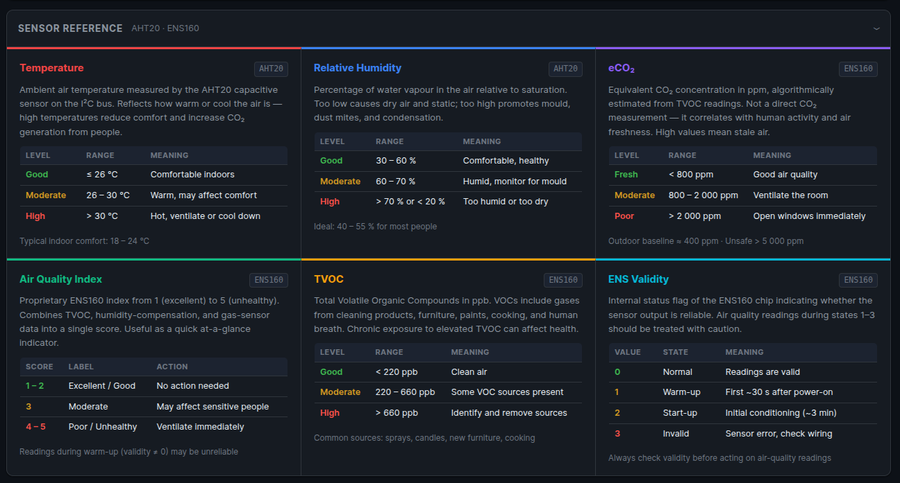
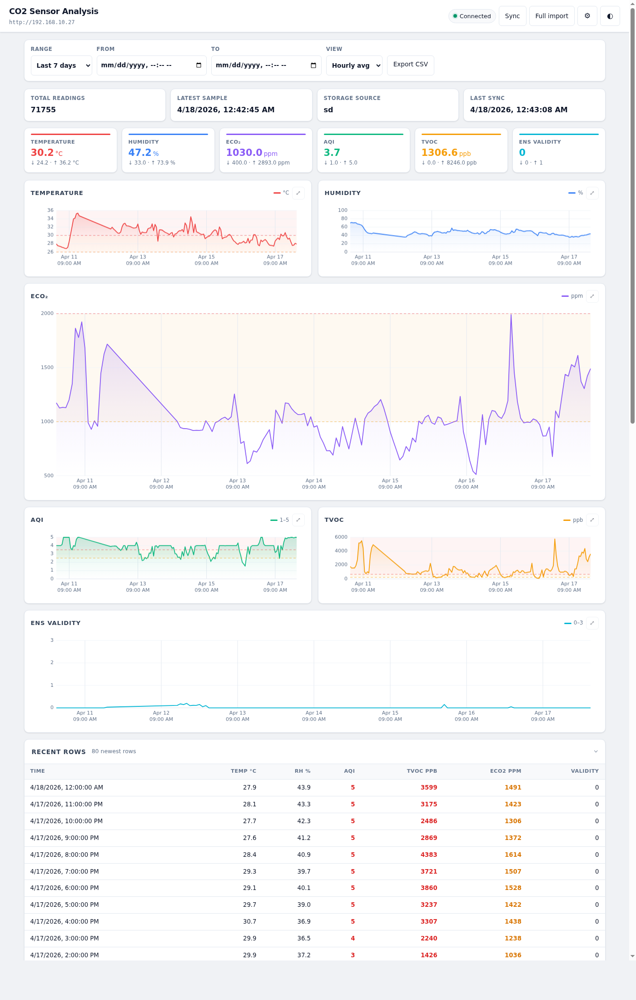

# ESP32 Air Quality Sensor

ESP32-C6 firmware for reading AHT20 (temperature/humidity) and ENS160 (air quality) data, storing historical samples (SD card preferred, NVS fallback), showing live values on an SSD1306 OLED, and serving a built-in web dashboard over external Wi-Fi when available, with SoftAP fallback.

## Sensor Readings

The device measures six quantities using two sensors on the I²C bus:

| Metric | Sensor | Unit | Good | Moderate | Poor |
|---|---|---|---|---|---|
| Temperature | AHT20 | °C | ≤ 26 | 26 – 30 | > 30 |
| Relative Humidity | AHT20 | % | 30 – 60 | 60 – 70 | > 70 or < 20 |
| eCO₂ | ENS160 | ppm | < 800 | 800 – 2 000 | > 2 000 |
| AQI | ENS160 | 1–5 | 1 – 2 | 3 | 4 – 5 |
| TVOC | ENS160 | ppb | < 220 | 220 – 660 | > 660 |
| ENS Validity | ENS160 | 0–3 | 0 (normal) | 1–2 (warm-up) | 3 (error) |

**AHT20** measures capacitive relative humidity and temperature. Readings are available within seconds of power-on and are unaffected by air quality.

**ENS160** is a metal-oxide gas sensor that estimates eCO₂ and TVOC algorithmically. It requires a warm-up period of ~30 s (validity = 1) and a start-up conditioning phase of ~3 min (validity = 2) before readings are reliable (validity = 0). The eCO₂ value is *not* a direct CO₂ measurement — it is derived from the TVOC signal and correlates with air freshness and human presence. Outdoor air is approximately 400 ppm eCO₂.



## Hardware
- ESP32-C6-DevKitC-1
- Sensor board with:
  - AHT20 temperature/humidity sensor
  - ENS160 air quality sensor

## Current Features
- Reads and logs:
  - Temperature (°C)
  - Humidity (%)
  - AQI
  - TVOC (ppb)
  - eCO2 (ppm)
  - ENS validity flag
- Stores sensor history to SD card (`/sdcard/logs.csv`) when available.
- Falls back to NVS circular buffer storage if SD card is unavailable.
- OLED interface (SSD1306, 128x64, I2C 0x3C):
  - 4-line live status view (time, T/RH, AQI/TVOC, eCO2/validity)
  - Health code markers per value (`G`/`Y`/`R`)
  - Button toggle on GPIO5 (press to turn OLED on/off)
- Tries external Wi-Fi first, then falls back to SoftAP only if STA is unavailable.
- Starts built-in HTTP server automatically on boot.
- Web dashboard at `/` with:
  - Live-updating table of stored values
  - Separate graph for each metric
- JSON API at `/json` for the built-in dashboard recent window.
- CSV download endpoint at `/csv`.
- Versioned server sync API under `/api/v1` for status, time-bounded history, and incremental polling.
- Optional Docker Compose analysis server for Raspberry Pi or another machine:
  - Polls the ESP32 sync API and imports all history on first connection.
  - Stores readings in SQLite.
  - Full-featured web dashboard (see [Web Analysis Dashboard](#web-analysis-dashboard)) with range filters, aggregation views, interactive charts, summary statistics, CSV export, dark mode, and a collapsible sensor reference guide.
- Syncs time over the STA connection when external Wi-Fi is available.
- Starts mDNS on STA so the dashboard can be reached via a stable `.local` name.

## Default Runtime Configuration
- STA dashboard URL: `http://co2-sensor.local/` when `WIFI_STA_SSID` / `WIFI_STA_PASS` are configured and reachable
- mDNS hostname: `co2-sensor`
- mDNS instance name: `CO2 Sensor`
- SoftAP SSID: `CO2-Sensor-AP`
- SoftAP password: `co2sensor123`
- SoftAP fallback URL: `http://192.168.4.1/`
- JSON endpoint: `/json`
- CSV endpoint: `/csv`
- Server status endpoint: `/api/v1/status`
- Server records endpoint: `/api/v1/records`
- Server sync endpoint: `/api/v1/sync`
- Sampling interval: 1 minute (`SENSOR_READ_INTERVAL_MS = 60000`)
- NVS ring-buffer capacity: 180 points (`NVS_SLOT_COUNT = 180`)
- SD log file path: `/sdcard/logs.csv`
- OLED I2C address: `0x3C` (SSD1306)
- OLED toggle button GPIO: `5`

## Project Structure
- `src/` main application code
- `include/` project headers
- `lib/` external/project libraries
- `test/` test files
- `server/` Dockerized data collector and analysis dashboard
- `platformio.ini` PlatformIO configuration
- `CMakeLists.txt` CMake/ESP-IDF project file
- `sdkconfig.esp32-c6-devkitc-1` board-specific ESP-IDF config

## Build, Flash, Monitor
From the project root:

```bash
/home/netlister/.platformio/penv/bin/platformio run -e esp32-c6-devkitc-1
/home/netlister/.platformio/penv/bin/platformio run -e esp32-c6-devkitc-1 -t upload
/home/netlister/.platformio/penv/bin/platformio device monitor -b 115200
```

Use the `~/.platformio/penv/bin/platformio` binary on this machine. `/usr/bin/platformio` resolves to an older incompatible core here.

## Wi-Fi Setup
1. Copy `src/secrets.h.example` to `src/secrets.h` if you have not created it yet.
2. Set `WIFI_STA_SSID` and `WIFI_STA_PASS` to the external Wi-Fi network you want the ESP32 to join.
3. Keep `WIFI_AP_SSID` and `WIFI_AP_PASS` set for fallback access when the external network is unavailable.
4. Rebuild and flash after changing credentials.

## Accessing the Dashboard
1. Power/flash the board and wait for boot logs.
2. If STA connects successfully, open:
   - Dashboard: `http://co2-sensor.local/`
   - JSON: `http://co2-sensor.local/json`
   - CSV: `http://co2-sensor.local/csv`
   - Server API status: `http://co2-sensor.local/api/v1/status`
3. If `.local` resolution is unreliable on your client, use the STA IP address printed in the boot log instead.
4. If STA is unavailable, connect your phone/laptop to Wi-Fi `CO2-Sensor-AP` and use:
   - Dashboard: `http://192.168.4.1/`
   - JSON: `http://192.168.4.1/json`
   - CSV: `http://192.168.4.1/csv`
   - Server API status: `http://192.168.4.1/api/v1/status`

## Network Startup Behavior
1. Boot initializes storage and sensors.
2. Firmware attempts STA connection using `WIFI_STA_SSID` and `WIFI_STA_PASS`.
3. On STA success, the device syncs time with `pool.ntp.org`, starts mDNS, and serves HTTP on the STA interface.
4. On STA failure or when credentials are blank, the device starts the fallback SoftAP and serves HTTP at `192.168.4.1`.

## OLED Display Layout
- Line 1: local time (`YY-MM-DD HH:MM`) when time is synced
- Line 2: temperature and humidity (`T` / `H`)
- Line 3: AQI and TVOC (`A` / `T`)
- Line 4: eCO2 and ENS validity (`C` / `V`)
- Marker legend: `G` = good, `Y` = warning, `R` = bad
- If data is unavailable for a sensor, value fields show `-`

## Data Source Behavior
- Startup tries SD card first (SPI pins: MISO=21, MOSI=22, CLK=19, CS=20).
- If SD mount succeeds, logs are appended to `/sdcard/logs.csv`.
- If SD mount fails, logging continues in NVS (`sensorlog` namespace).
- Web graph/table endpoints read from SD when available, otherwise from NVS.

## Server API
The server-facing API is separate from the dashboard endpoints and is intended for periodic polling by another service.

General behavior:
- All `/api/v1/*` endpoints return JSON.
- Historical results are ordered oldest to newest.
- Records with `unix_time = 0` are excluded from `/api/v1/*`.
- Storage source is reported as `"sd"` or `"nvs"`.

### `GET /api/v1/status`
Returns current device metadata and the newest valid-timestamp record.

Example fields:
- `device_time_unix`
- `sample_interval_sec`
- `storage_source`
- `sd_ready`
- `nvs_ready`
- `latest_record`

### `GET /api/v1/records`
Returns a bounded history window.

Query parameters:
- `from`: optional inclusive unix timestamp
- `to`: optional inclusive unix timestamp
- `limit`: optional number of rows, default `120`, max `240`

Behavior:
- With no `from` and no `to`, returns the newest `limit` records.
- With `from` and/or `to`, returns the matching chronological slice.
- Response includes `count`, `limit`, `has_more`, `source`, `from`, `to`, and `entries`.

Examples:
- Newest 60 rows: `/api/v1/records?limit=60`
- Last day starting at a timestamp: `/api/v1/records?from=1712800000`
- Bounded range: `/api/v1/records?from=1712800000&to=1712886400&limit=120`

### `GET /api/v1/sync`
Returns records newer than a server-held cursor for efficient incremental sync.

Query parameters:
- `since`: optional exclusive unix timestamp cursor, default `0`
- `limit`: optional batch size, default `120`, max `240`

Response fields:
- `count`
- `limit`
- `has_more`
- `next_since`
- `source`
- `entries`

Polling model:
1. Call `/api/v1/sync?since=0` for the initial import.
2. Store the returned `next_since` value after successfully ingesting the batch.
3. If `has_more` is `true`, call `/api/v1/sync?since=<next_since>` again immediately.
4. Otherwise wait until the next polling interval.

## Docker Analysis Server
Run the companion server on a Raspberry Pi or separate machine on the same network:

```bash
SENSOR_BASE_URL=http://192.168.1.50 docker compose up --build -d
```

Open `http://localhost:8000/` on that machine. Replace `192.168.1.50` with the ESP32 STA IP address from the serial boot log. Set `SERVER_PORT=8080` if port 8000 is already in use.

The server persists data in a Docker volume named `co2_sensor_data`. On first successful connection it calls the ESP32 `/api/v1/sync?since=0` endpoint until all available history has been imported, then continues incremental polling using the returned cursor. See `server/README.md` for API details and operational notes.

## Web Analysis Dashboard

The companion analysis server (`server/`) runs as a Docker container and provides a full-featured dashboard accessible from any browser on the local network.

### Starting the server

```bash
cp .env.example .env          # set SENSOR_BASE_URL to the ESP32 IP or co2-sensor.local
docker compose up -d --build
```

Open `http://<server-ip>:8000/` in any browser.

### Features

**Data range and aggregation**
Select a preset time range (last 24 h / 7 days / 30 days / year / all) or enter a custom start/end date. Choose between raw samples, minute averages, hourly averages, or daily averages.

**Summary cards**
Six cards — one per metric — show the average, minimum, and maximum value for the selected range. Each card has a coloured top bar matching the metric's chart colour.

**Interactive charts**
One chart per metric, laid out in a responsive grid:
- Temperature and Humidity — side by side
- eCO₂ — full-width, taller
- AQI and TVOC — side by side
- ENS Validity — full-width, compact

Every chart features:
- Area gradient fill under the line
- Smart X-axis time labels that switch between `HH:mm`, `HH:mm` with date, or date-only depending on the selected range
- Dashed threshold lines (yellow/red) marking health boundaries
- Lightly shaded danger zones above each threshold
- **Expand button** (`⤢`) in the chart header — click to make any chart full-width and taller; state is saved across page reloads

Hovering over a chart shows a crosshair and a tooltip with the exact timestamp and value at that point.

**Recent rows table**
Collapsible table showing the 80 most recent readings. Air quality cells are colour-coded green / amber / red. Click the header row to collapse or expand.

**Sensor reference guide**
Collapsible section (collapsed by default) with one card per metric explaining what the sensor measures, a good / moderate / poor range table, and practical notes. Useful as a quick in-page reference without needing external documentation.

**Sync controls**
- **Sync** — triggers an immediate incremental poll of the ESP32
- **Full import** — re-imports the entire ESP32 history from timestamp 0

**Settings**
Click the ⚙ button to change the ESP32 address at runtime without restarting the server. The new address takes effect immediately and the sync loop reconnects automatically.

**Dark mode**
Click the ◐ button to toggle between light and dark theme. The preference is saved in `localStorage`.

**CSV export**
Downloads all readings in the selected time range as a plain CSV file.

### Screenshot



## KiCad Schematic & PCB Design
The hardware was designed in KiCad and includes:
- ESP32-C6 module connections (power, boot, and programming signals)
- I2C routing for AHT20 and ENS160 sensors
- GPIO breakout for OLED button and SPI SD card interface
- Compact 2-layer PCB layout optimized for sensor board assembly

### Schematic


### PCB Layout


### 3D PCB Views
Front view:


Back view:


And yes, one design choice may look unnecessary - purely for "airflow optimization," obviously.

## Final Result Photos
Assembled/produced board (front):


Assembled/produced board (back):


## Example Serial Logs
```text
I (...) MAIN: NVS logging enabled (sensorlog)
I (...) MAIN: NVS stats: used=... free=... total=... namespaces=...
I (...) NET: Connecting to external WiFi SSID=...
I (...) NET: STA connected: IP=192.168.1.50 GW=192.168.1.1
I (...) MDNS: mDNS started: http://co2-sensor.local/
I (...) WEB: Web server started on http://co2-sensor.local/
I (...) MAIN: AHT: T=25.17 C  RH=47.53 %
I (...) MAIN: ENS: AQI=3  TVOC=331 ppb  eCO2=812 ppm
```
