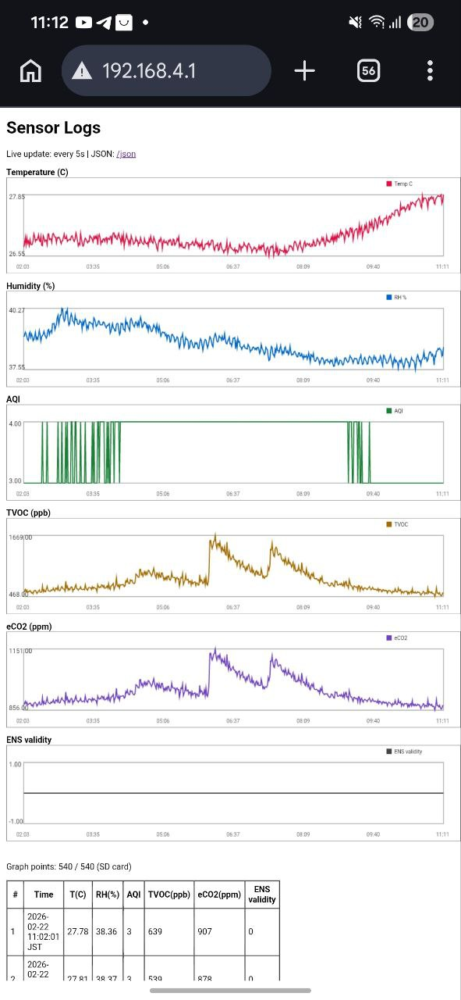
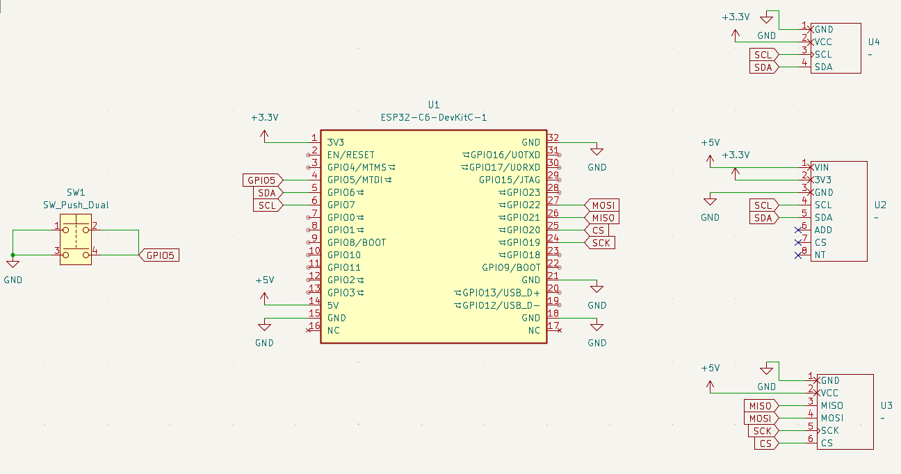
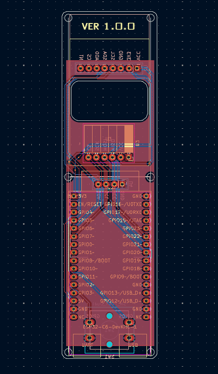
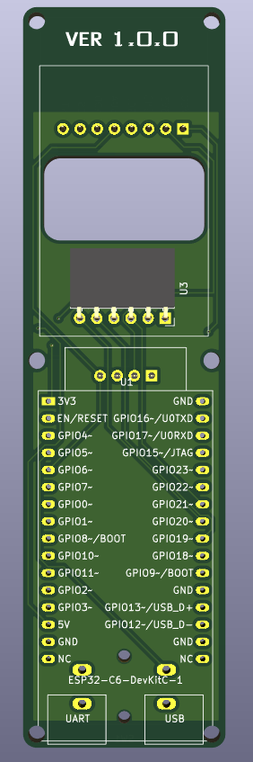
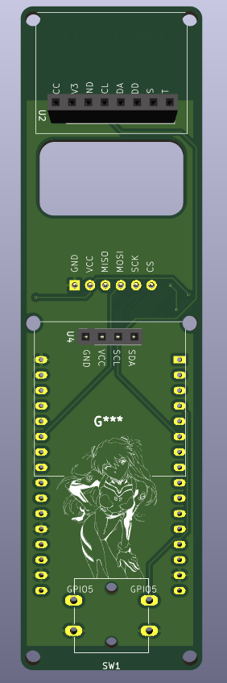
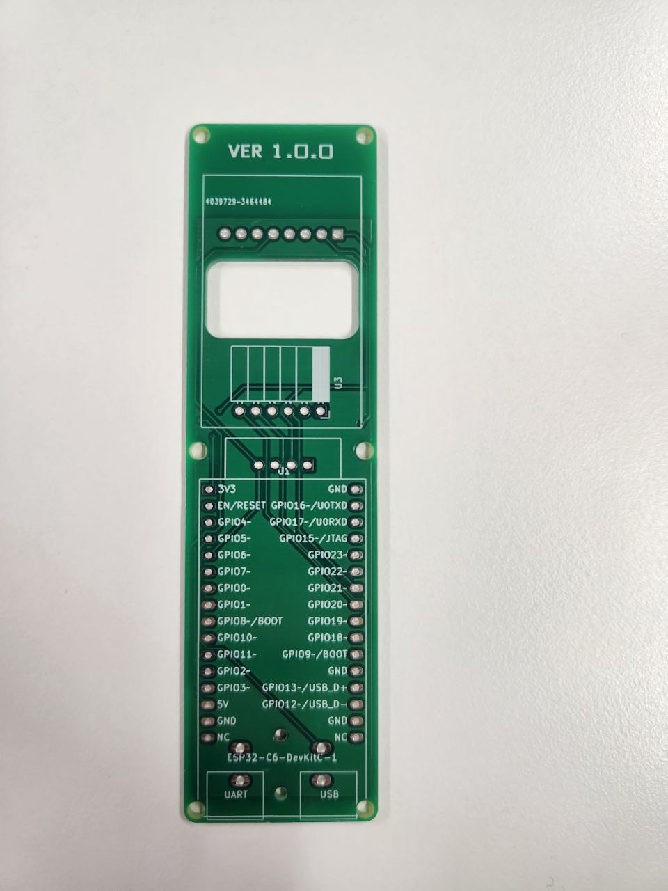
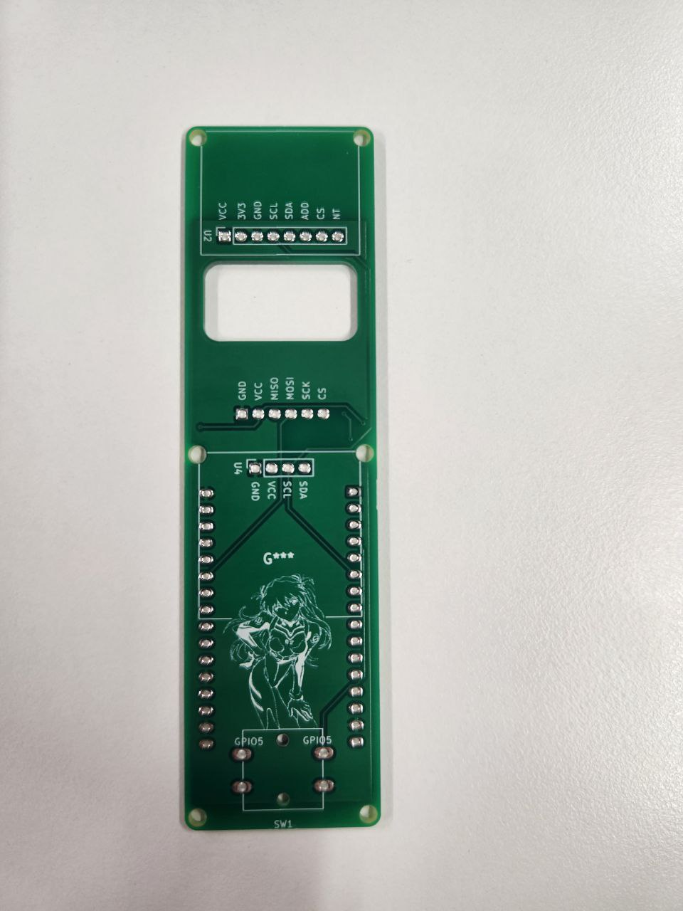

# ESP32 Air Quality Sensor

ESP32-C6 firmware for reading AHT20 (temperature/humidity) and ENS160 (air quality) data, storing historical samples (SD card preferred, NVS fallback), showing live values on an SSD1306 OLED, and serving a built-in web dashboard over Wi-Fi hotspot mode.

## Hardware
- ESP32-C6-DevKitC-1
- Sensor board with:
  - AHT20 temperature/humidity sensor
  - ENS160 air quality sensor

## Current Features
- Reads and logs:
  - Temperature (°C)
  - Humidity (%)
  - AQI
  - TVOC (ppb)
  - eCO2 (ppm)
  - ENS validity flag
- Stores sensor history to SD card (`/sdcard/logs.csv`) when available.
- Falls back to NVS circular buffer storage if SD card is unavailable.
- OLED interface (SSD1306, 128x64, I2C 0x3C):
  - 4-line live status view (time, T/RH, AQI/TVOC, eCO2/validity)
  - Health code markers per value (`G`/`Y`/`R`)
  - Button toggle on GPIO5 (press to turn OLED on/off)
- Starts Wi-Fi SoftAP automatically on boot.
- Starts built-in HTTP server automatically on boot.
- Web dashboard at `/` with:
  - Live-updating table of stored values
  - Separate graph for each metric
- JSON API at `/json` for easier parsing/integration.
- CSV download endpoint at `/csv`.
- Optional NTP sync via STA credentials before AP startup.

## Default Runtime Configuration
- SoftAP SSID: `CO2-Sensor-AP`
- SoftAP password: `co2sensor123`
- AP URL: `http://192.168.4.1/`
- JSON endpoint: `http://192.168.4.1/json`
- CSV endpoint: `http://192.168.4.1/csv`
- Sampling interval: 1 minute (`SENSOR_READ_INTERVAL_MS = 60000`)
- NVS ring-buffer capacity: 180 points (`NVS_SLOT_COUNT = 180`)
- SD log file path: `/sdcard/logs.csv`
- OLED I2C address: `0x3C` (SSD1306)
- OLED toggle button GPIO: `5`

## Project Structure
- `src/` main application code
- `include/` project headers
- `lib/` external/project libraries
- `test/` test files
- `platformio.ini` PlatformIO configuration
- `CMakeLists.txt` CMake/ESP-IDF project file
- `sdkconfig.esp32-c6-devkitc-1` board-specific ESP-IDF config

## Build, Flash, Monitor
From the project root:

```bash
platformio run -e esp32-c6-devkitc-1
platformio run -e esp32-c6-devkitc-1 -t upload
platformio device monitor -b 115200
```

## Accessing the Dashboard
1. Power/flash the board and wait for boot logs.
2. Connect your phone/laptop to Wi-Fi `CO2-Sensor-AP`.
3. Open:
   - Dashboard: `http://192.168.4.1/`
   - JSON: `http://192.168.4.1/json`
  - CSV: `http://192.168.4.1/csv`

Dashboard preview:


## OLED Display Layout
- Line 1: local time (`YY-MM-DD HH:MM`) when time is synced
- Line 2: temperature and humidity (`T` / `H`)
- Line 3: AQI and TVOC (`A` / `T`)
- Line 4: eCO2 and ENS validity (`C` / `V`)
- Marker legend: `G` = good, `Y` = warning, `R` = bad
- If data is unavailable for a sensor, value fields show `-`

## Data Source Behavior
- Startup tries SD card first (SPI pins: MISO=21, MOSI=22, CLK=19, CS=20).
- If SD mount succeeds, logs are appended to `/sdcard/logs.csv`.
- If SD mount fails, logging continues in NVS (`sensorlog` namespace).
- Web graph/table endpoints read from SD when available, otherwise from NVS.

## KiCad Schematic & PCB Design
The hardware was designed in KiCad and includes:
- ESP32-C6 module connections (power, boot, and programming signals)
- I2C routing for AHT20 and ENS160 sensors
- GPIO breakout for OLED button and SPI SD card interface
- Compact 2-layer PCB layout optimized for sensor board assembly

### Schematic


### PCB Layout


### 3D PCB Views
Front view:


Back view:


And yes, one design choice may look unnecessary - purely for "airflow optimization," obviously.

## Final Result Photos
Assembled/produced board (front):


Assembled/produced board (back):


## Example Serial Logs
```text
I (...) MAIN: NVS logging enabled (sensorlog)
I (...) MAIN: NVS stats: used=... free=... total=... namespaces=...
I (...) MAIN: WiFi AP started: SSID=CO2-Sensor-AP CH=1
I (...) MAIN: Web server started on http://192.168.4.1/
I (...) MAIN: AHT: T=25.17 C  RH=47.53 %
I (...) MAIN: ENS: AQI=3  TVOC=331 ppb  eCO2=812 ppm
```
